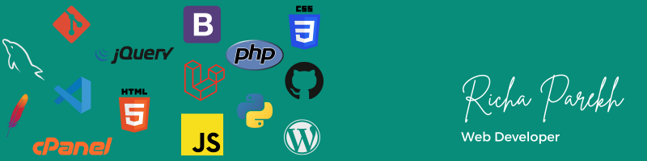

<!-- You can create your own header images using Canva, it has a lot of templates. If you do, use the following link https://www.canva.com/join/celeriac-tread-jellyfish -->
I'm a Web developer who loves to learn about new things. Connect with me on LinkedIn.

## ⚡ Skills:
- PHP
- Laravel
- Codigniter
- Javascript
- Jquery
- Mysql
- HTML
- CSS
- Bootstrape
- Wordpress
- Git
